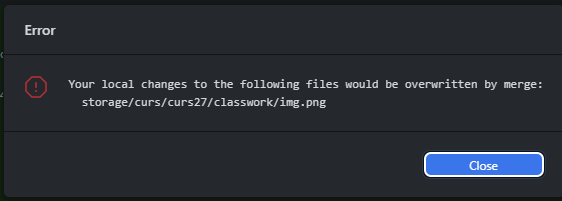

# Branches

## Create new branch
Github desktop > click current branch > click new branch > insert name > click create new branch

## Publish new branch
Github Desktop > click Publish new branch 

## Choosing branch name
Exemple:
1. cristina/teme/curs27
2. cristina/proiect
3. feature/taskId - aici pot fi toate new features (~300 pe an)
4. bugfix/taskId - aici pot fi toate bugfixes (~1000 pe an)
5. feature/deploy/taskId
6. deploy/production - aici poate fi codul care ruleaza in productie (1 branch)

## Commit
As usual

## Merge
Read the manual here: https://git-scm.com/book/en/v2/Git-Branching-Basic-Branching-and-Merging

Steps:
1. Github desktop > checkout branchul in care vrei sa aduci modificari (ex: main)
2. Click branch > merge into current branch
3. Alege branchul pe care vrei sa il aduci (ex: feature-44)
4. Vizualieaza daca e ok asta: 
    * 1 commit = vom aduce 1 commit in branchul curent
    * from `feature-44` = asta e branchul din care aducem cod
    * into `main` = asta e branchul in care aducem cod
5. Click create a merge commit
6. Click push origin

(Opt) Fix errors:
1. Daca vezi asta 
* inseamna ca ai modificari pe care nu le-ai dat commit, asa ca:
  * da commit
  * reia flow-ul
